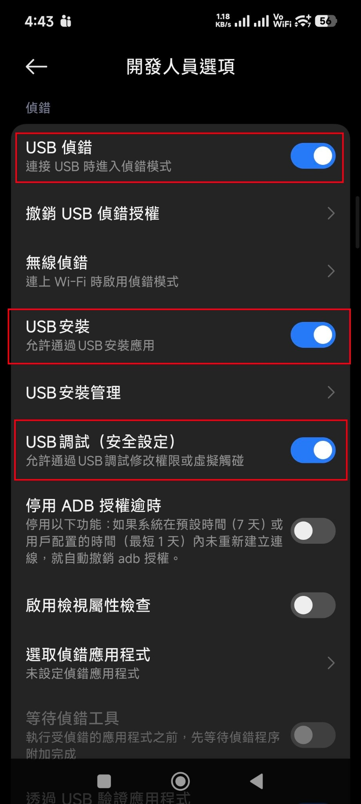
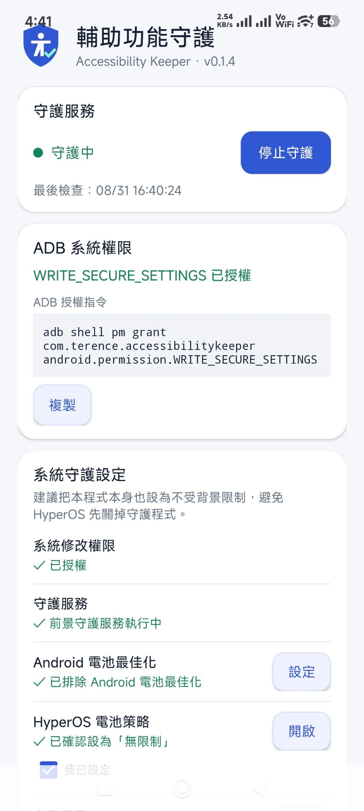
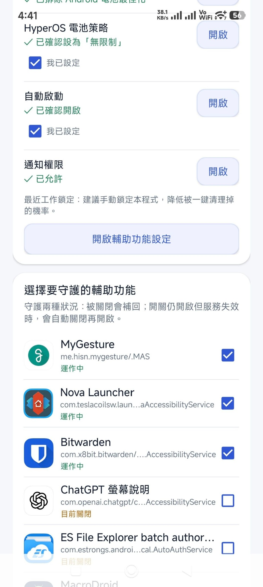

# Accessibility Keeper（輔助功能守護）

[](https://github.com/Terence0816/AccessibilityKeeper/releases/latest)
[](https://github.com/Terence0816/AccessibilityKeeper/releases)
[](https://github.com/Terence0816/AccessibilityKeeper/stargazers)

Android / HyperOS 輔助功能服務守護工具。

# Accessibility Keeper（輔助功能守護）

Android / HyperOS 輔助功能服務守護工具。

當使用者指定的 Accessibility Service 被系統關閉，或系統設定中雖然仍顯示為「開啟」，但服務實際上已經失效時，Accessibility Keeper 會持續檢查並嘗試自動恢復。

> 目前版本：**v0.1.5**

---

## 功能特色

- 守護使用者自行選擇的輔助功能服務
- 偵測輔助功能被系統關閉後自動恢復
- 偵測「開關仍開啟，但服務實際失效」的異常狀態
- 異常時可自動關閉並重新啟用輔助功能服務
- 前景守護服務
- 開機後自動恢復守護
- 顯示最後檢查時間
- Android 電池最佳化排除狀態檢查
- HyperOS 電池策略設定引導
- HyperOS 自動啟動設定引導
- 通知權限狀態檢查
- 可同時守護多個 Accessibility Service

---

## 適用情況

部分 Android 裝置，尤其是 HyperOS / MIUI 系統，可能因為：

- 背景程序清理
- 電池最佳化
- 系統記憶體回收
- App 更新
- 系統重啟
- 一鍵清理
- 系統本身的 Accessibility Service 異常

造成輔助功能服務被關閉。

另外也可能出現一種比較難發現的情況：

> Android 設定中仍顯示輔助功能已經開啟，但實際上該 Accessibility Service 已經停止運作。

Accessibility Keeper 就是用來處理這兩種情況。

---

# 安裝與設定

## 1. 安裝 APK

請從 GitHub 的 **Releases** 頁面下載最新版 APK。

安裝完成後先開啟 Accessibility Keeper。

第一次執行時，程式會檢查目前系統權限與背景執行相關設定。

---

## 2. 授予 WRITE_SECURE_SETTINGS 權限

Accessibility Keeper 需要 Android 系統權限：

```text
android.permission.WRITE_SECURE_SETTINGS
```

這個權限無法透過一般 Android 權限視窗直接授予，需要使用 ADB 執行一次授權。

### ADB 指令

```bash
adb shell pm grant com.terence.accessibilitykeeper android.permission.WRITE_SECURE_SETTINGS
```

授權成功後，程式主畫面會顯示：

```text
WRITE_SECURE_SETTINGS 已授權
```

一般情況下，這個權限只需要授權一次。

完成授權後，不需要讓手機長期連接電腦。

---

## 3. Xiaomi / Redmi / POCO / HyperOS 設定



如果使用 Xiaomi、Redmi、POCO、MIUI 或 HyperOS 裝置，在執行 ADB 授權前，可能需要進入：

**設定 → 更多設定 → 開發人員選項**

確認以下設定已開啟：

- **USB 偵錯**
- **USB 安裝**
- **USB 調試（安全設定）**

### 示範

上圖紅框中的三個項目都建議先開啟：

1. `USB 偵錯`
2. `USB 安裝`
3. `USB 調試（安全設定）`

其中 **USB 調試（安全設定）** 在部分 Xiaomi / HyperOS 系統上，可能是執行系統設定相關 ADB 指令時所需要的項目。

完成 `WRITE_SECURE_SETTINGS` 授權後，如果平常沒有使用 ADB 的需求，可以依自己的使用習慣關閉 USB 偵錯。

> 不同 HyperOS / MIUI 版本的選項名稱或位置可能稍有不同。

---

# 主畫面與系統守護設定



Accessibility Keeper 主畫面會顯示目前的守護狀態與系統設定。

## ADB 系統權限

確認是否已取得：

```text
WRITE_SECURE_SETTINGS
```

如果尚未授權，可直接複製畫面中的 ADB 指令到電腦執行。

### 示範

授權成功後，畫面應顯示：

```text
WRITE_SECURE_SETTINGS 已授權
```

---

## 系統修改權限

正常情況下應顯示：

```text
✓ 已授權
```

代表 Accessibility Keeper 已具備修改 Android 輔助功能系統設定所需要的權限。

---

## 守護服務

正常啟動後會顯示：

```text
✓ 前景守護服務執行中
```

畫面最上方則會顯示：

```text
● 守護中
```

代表 Accessibility Keeper 正在背景持續監控。

---

## Android 電池最佳化

建議將 Accessibility Keeper 排除 Android 電池最佳化。

正常設定完成後會顯示：

```text
✓ 已排除 Android 電池最佳化
```

如果尚未設定，可以按右方的：

**設定**

進入 Android 電池最佳化相關頁面。

---

## HyperOS 電池策略

HyperOS 使用者建議將 Accessibility Keeper 的電池策略設定為：

```text
無限制
```

完成後畫面會顯示：

```text
✓ 已確認設為「無限制」
```

避免 HyperOS 因為背景省電機制停止 Accessibility Keeper。

---

## 自動啟動

HyperOS / MIUI 使用者建議開啟：

**自動啟動**

完成後程式會顯示：

```text
✓ 已確認開啟
```

這樣重新開機之後 Accessibility Keeper 才比較不容易受到系統限制。

---

## 通知權限

建議允許 Accessibility Keeper 的通知權限。

完成後會顯示：

```text
✓ 已允許
```

由於本程式使用 Android 前景服務持續監控，因此建議保留通知權限。

---

## 最近工作鎖定

HyperOS 使用者也建議在「最近工作」畫面中，手動將 Accessibility Keeper 鎖定。

這可以降低使用「一鍵清理」時，Accessibility Keeper 被一起清除的機率。

---

# 選擇要守護的輔助功能



完成系統設定後，在主畫面下方可以看到：

**選擇要守護的輔助功能**

Accessibility Keeper 會列出手機中可偵測到的 Accessibility Service。

例如：

- MyGesture
- Nova Launcher
- Bitwarden
- ChatGPT 螢幕說明
- ES File Explorer
- MacroDroid
- 其他使用 Android Accessibility Service 的 App

每個項目旁邊都有勾選框。

勾選代表：

> 將這個 Accessibility Service 加入 Accessibility Keeper 的守護清單。

### 示範

例如畫面中：

```text
MyGesture        ✓ 運作中
Nova Launcher    ✓ 運作中
Bitwarden        ✓ 運作中
ChatGPT 螢幕說明   目前關閉
```

如果要讓 Accessibility Keeper 守護 MyGesture、Nova Launcher、Bitwarden，就將右側方框勾選。

---

## 狀態說明

### 運作中

如果顯示：

```text
運作中
```

代表該 Accessibility Service 目前已開啟。

### 目前關閉

如果顯示：

```text
目前關閉
```

代表這個 Accessibility Service 目前尚未啟用。

第一次使用仍需要先到 Android：

**設定 → 輔助功能**

手動開啟該 App 的 Accessibility Service。

Accessibility Keeper 的「勾選守護」並不是用來代替第一次人工授權。

---

# 守護機制

Accessibility Keeper 主要處理兩種狀況。

## 1. Accessibility Service 被關閉

當系統、HyperOS 或其他背景管理機制將已守護的 Accessibility Service 關閉時，Accessibility Keeper 會偵測狀態並嘗試恢復服務。

---

## 2. 開關還在，但服務已失效

某些 Android / HyperOS 裝置可能出現：

```text
設定顯示：開啟
實際狀態：服務已停止運作
```

也就是系統設定中的開關看起來仍然正常，但 App 實際已無法正常使用 Accessibility Service。

Accessibility Keeper 會持續監控所選服務；偵測到異常時，會嘗試透過重新關閉 / 開啟服務的方式恢復。

概念如下：

```text
Accessibility Service 異常
        ↓
偵測目前服務狀態
        ↓
關閉異常服務
        ↓
重新啟用 Accessibility Service
        ↓
繼續守護
```

---

# 建議完整設定流程

建議依照以下順序完成：

1. 安裝 Accessibility Keeper
2. 開啟手機的開發人員選項
3. 開啟 USB 偵錯
4. Xiaomi / HyperOS 視需要開啟 USB 安裝與 USB 調試（安全設定）
5. 使用 ADB 授予 `WRITE_SECURE_SETTINGS`
6. 排除 Android 電池最佳化
7. HyperOS 電池策略設為「無限制」
8. 開啟 HyperOS 自動啟動
9. 允許通知權限
10. 最近工作中鎖定 Accessibility Keeper
11. 到 Android 輔助功能設定，手動開啟需要使用的 Accessibility Service
12. 回到 Accessibility Keeper，勾選需要守護的服務
13. 啟動守護服務

設定完成後，主畫面應顯示：

```text
● 守護中
```

---

# ADB 授權完整示範

先在電腦確認 ADB 可以看到手機：

```bash
adb devices
```

正常會看到類似：

```text
List of devices attached
XXXXXXXX    device
```

然後執行：

```bash
adb shell pm grant com.terence.accessibilitykeeper android.permission.WRITE_SECURE_SETTINGS
```

執行完成後重新回到 Accessibility Keeper。

如果授權成功，主畫面會顯示：

```text
WRITE_SECURE_SETTINGS 已授權
```

若 `adb devices` 顯示：

```text
unauthorized
```

請查看手機畫面，接受「允許 USB 偵錯」授權後再執行一次。

---

# 系統需求

- Android 8.0 或以上
- Min SDK 26
- Target SDK 36
- Compile SDK 36
- 第一次設定需要 ADB
- 不需要 Root

---

# APK

最新版 APK 請從 GitHub 的 **Releases** 頁面下載。

---


# 注意事項

- 本程式需要 `WRITE_SECURE_SETTINGS` 才能使用自動修復相關功能。
- `WRITE_SECURE_SETTINGS` 需要透過 ADB 授權。
- 不需要 Root。
- 第一次啟用某個 Accessibility Service 時，仍需由使用者自行在 Android 設定中授權。
- 不同手機品牌對背景 App 的限制方式不同。
- HyperOS / MIUI 建議完成「電池無限制」、「自動啟動」與「最近工作鎖定」。
- Android / HyperOS 系統更新後，如果守護狀態異常，建議重新確認相關權限與背景設定。

---

# 關於

**Accessibility Keeper / 輔助功能守護**

開發者：

**Terence0816**

GitHub：

https://github.com/Terence0816/AccessibilityKeeper

Accessibility Keeper 的目的，是降低 Android / HyperOS 因背景管理、系統清理或其他異常導致 Accessibility Service 無預警停止或失效的情況。


## License

目前此專案尚未指定開源授權條款。

原始碼公開不代表自動授權第三方修改、重新發布或商業使用。
